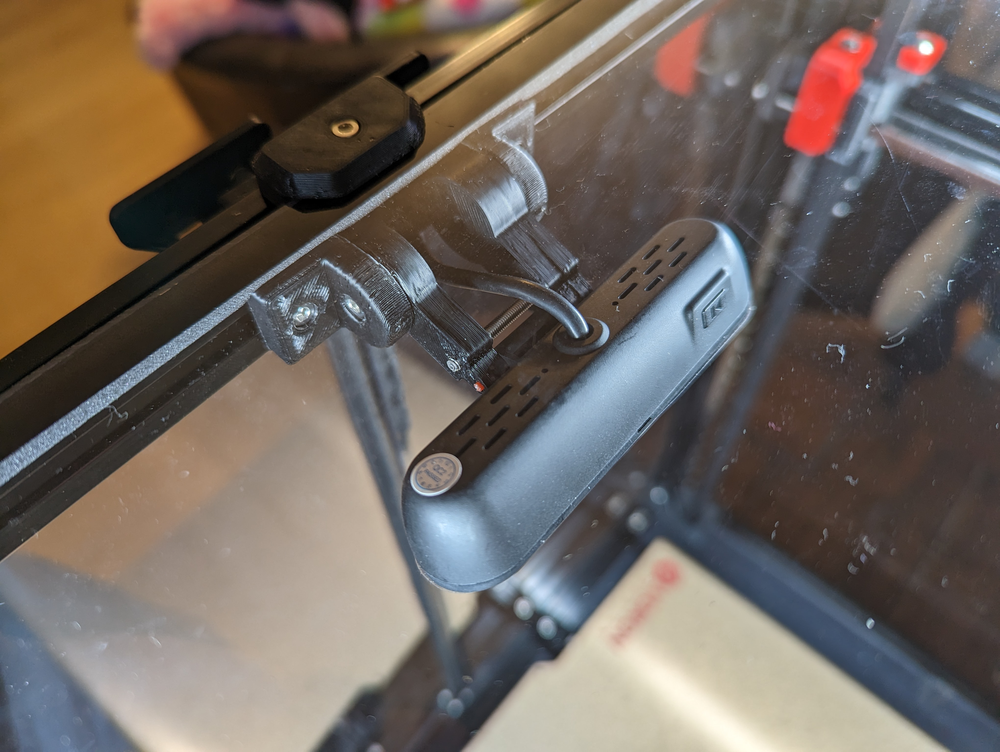
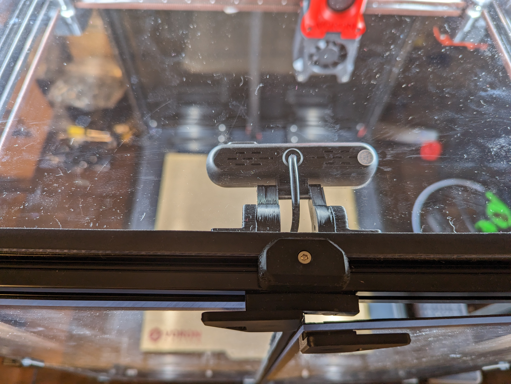
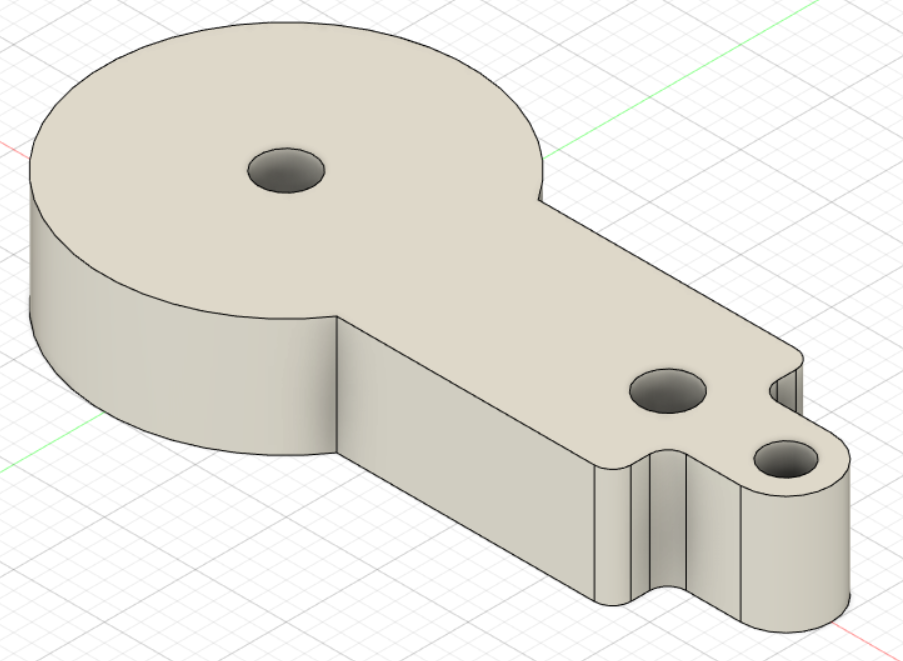
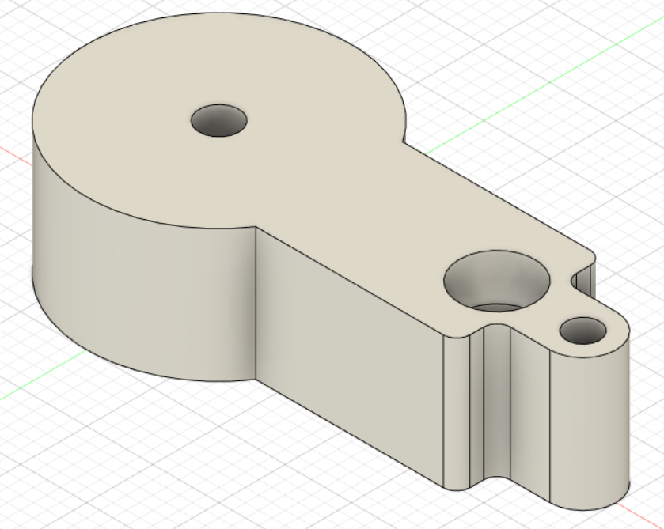
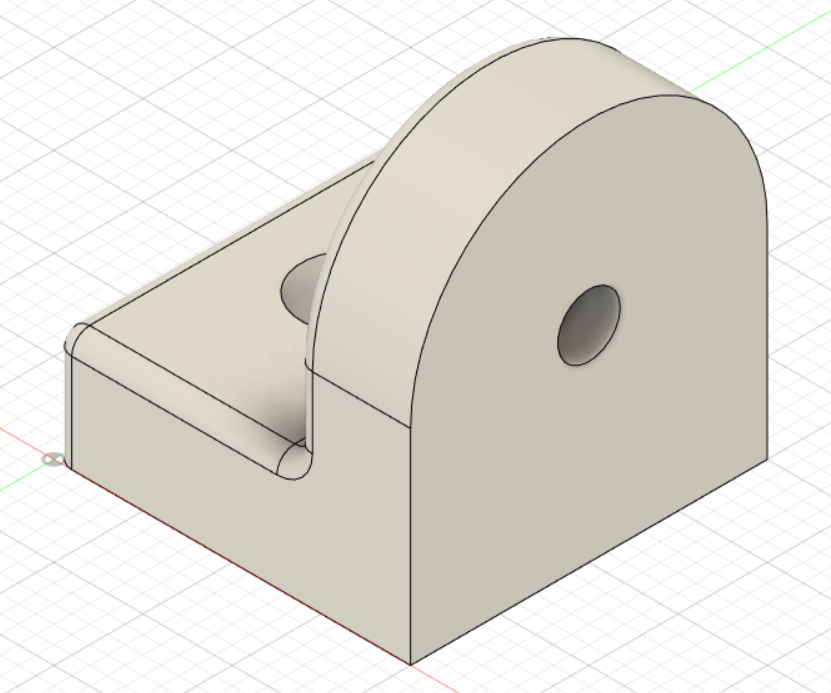

# handy-webcam-holder
A webcam mount for common webcams that have a horizontal tube-like hole in the back. The webcam mounts to a 2020 extrusion, including Voron 2.4.
https://github.com/iovsiann/webcam-mount-for-common-webcams/

1. Print the parts. Use ABS, PETG or ASA that can withstand temperatures higher than PLA in your print chamber.
2. Take an M3 screw long enough to span between the two arms; drive it through the left arm into the plastic hole of the right arm
3. Mount the camera using a piece of 1.75 filament
4. Affix the two extrusion mounts to the 2020 extrusion using M3 screws and extrusion slot nuts or T-nuts or hammer nuts or roll-in-spring nuts
5. Tighten the long M3 screw gently. The webcam should stay firmly in place (not drop down), but be moveable by hand with little effort. Don't overtighten.

